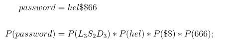
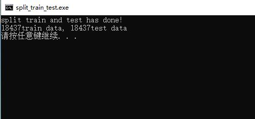
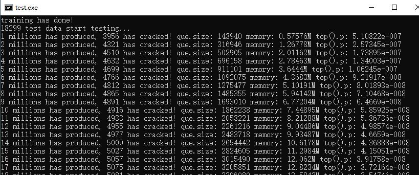
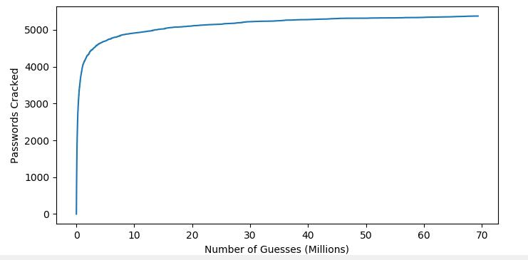

## PCFG介绍

PCFG是一种基于经典统计学的口令猜测算法，论文中描述其性能比使用默认规则集的John the Ripper能多破解28%-129%的密码。

## PCFG算法过程

1、每种密码可以使用LDS的方式表示，例如hel\$\$666，可以表示为

2、根据训练集统计每个密码不同部分出现的频率：

3、得到train set之后，将所有的LDS放到优先队列中生成对应的guess，最后将生成的guesses和test set进行对比，得到最后的破解率。

## 代码的运行效果

1、运行split_train_test.cpp根据myspace.txt字典文件，首先清洗掉带有不可见的字符的密码，然后随机生成训练集myspace_train.txt和测试集myspace_test.txt

2、运行train_and_test.cpp，对myspace_train.txt进行训练，然后对myspace_test.txt进行测试，同时将破解的进度每隔1000个输出到文件XY.txt中

3、运行draw.py对XY.txt进行绘图

## 问题和解决方法

1、开始的时候数据生成的不多，内存开销比较大，后来把优先队列的数据改为指针存储，这样可以减小一部分的内存开销，不过使用new、delete容易生成内存碎片，后续可以考虑使用内存池进行优化。

